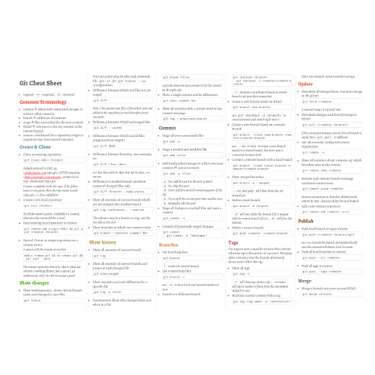

Git Cheat Sheet
===============

This is a comprehensive cheat sheet for daily work with `Git`.

Usage
-----

A webview of the cheat sheet is available at 

* https://pixelbrackets.github.io/git_cheat_sheet/

A PDF to print out is available at

* https://pixelbrackets.github.io/git_cheat_sheet/git_cheat_sheet.pdf

The cheat sheet is [written in Markdown](https://github.com/pixelbrackets/git_cheat_sheet/blob/master/git_cheat_sheet.md)
and converted to HTML & PDF on every tagged release.

Source
------

https://github.com/pixelbrackets/git_cheat_sheet

License
-------

Creative Commons Attribution ShareAlike 3.0 (CC-BY-SA 3.0)

The Creative Commons License can be found at https://creativecommons.org/licenses/by-sa/3.0/

Author
------

Dan Untenzu (<mail@pixelbrackets.de> / [@pixelbrackets](https://github.com/pixelbrackets))

Contribution
------------

This documentation is Open Source, so please use, patch, extend or fork it.

I welcome every [Pull Request](https://github.com/pixelbrackets/git_cheat_sheet/pulls).
